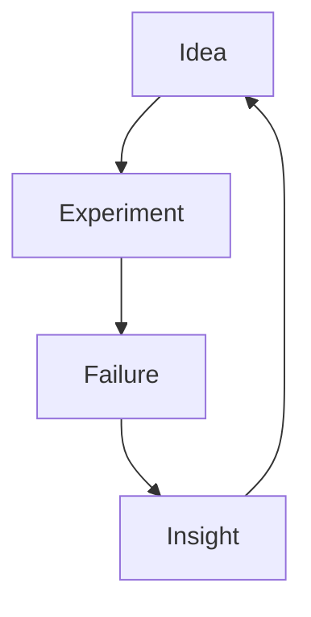

# ✨ Blog Concept: Ideas, Thoughts & Builds

A living space on the internet where thinking meets building.

---

## 🧠 Core Sections

### 💡 Ideas & Thoughts

Short posts capturing:

* random insights
* half-baked ideas
* “wait… what if?” moments
* personal philosophies

> Think Twitter threads, but with room to breathe.

---

### 🚧 Projects & Updates

A transparent log of what you're working on:

* progress updates
* lessons learned
* failures (especially failures)
* behind-the-scenes decisions

```
Day 14: broke everything  
Day 15: fixed it (kind of)  
Day 16: broke it differently
```

---

### 📚 Cheatsheets

A dedicated section for quick references:

* commands you always forget
* frameworks summarized in 5 minutes
* mental models
* “future me will thank me” notes

Example:

```bash
# Git panic button
git add .
git commit -m "save me"
git push
```

---

### 🛠 Tools

Curated and tested tools you actually use:

* dev tools
* productivity hacks
* niche gems from the internet

You can add:

* mini reviews
* use-cases
* pros/cons

---

## 🌶 Extra Ideas


### 🧩 Brain Dumps

Unfiltered thinking:

* messy notes
* sketches of ideas
* connections between unrelated things



---

### 📈 Growth Logs

Track your progress over time:

* skills you're learning
* habits you're building
* reflections every month

---

### 🔥 Hot Takes

Your controversial (or just strong) opinions:

* industry trends
* tools everyone loves but you don’t
* things that are overrated/underrated

---

### 🧭 “If I Had to Start Over”

Posts where you:

* explain concepts from scratch
* simplify complex topics
* create beginner-friendly guides

---

## 🎨 Style & Tone

* conversational, not corporate
* curious > authoritative
* honest > polished
* slightly chaotic (in a good way)

---

## 🧪 Optional Fun Elements

### Collapsible Notes

<details>
<summary>Click to expand a secret note 👀</summary>

You don’t need to know everything to start.
You just need to start.

</details>

---

### Highlighted Insight

> ⚡ **Rule of thumb:**
> If it's useful twice, turn it into a cheatsheet.

---

### Inline Code Vibes

Use `inline code` to make things feel technical and cool.

---

## 🚀 Closing Thought

This blog isn’t a portfolio.
It’s a **thinking space**.

Messy is allowed.
Incomplete is expected.
Interesting is the goal.
